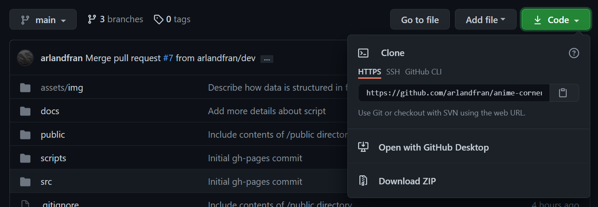

# Anime Corner Rankings

[View Deployed Site here](https://arlandfran.github.io/anime-corner-rankings/)

Anime Corner releases a ranking of the most popular anime based on episodes that air during the week, and all of this data is collated and then presented in a graphic that is distributed on all their social media feeds. Each week can be found on their own posts [here](https://animecorner.me/category/anime-corner/rankings/anime-of-the-week/).

The aim of this site is to consolidate all of this data into one place where users can navigate through the weekly rankings for each of the [anime seasons](https://www.reddit.com/r/anime/wiki/anime_related_terms), and also learn more about an anime in the ranking if they want to.

**Site Goals**:

- To provide members of the Anime Corner community a pleasant experience for viewing the weekly rankings.
- Make it easier for users to quickly find a past ranking without browsing through a list of blog posts.
- Provide details about an anime in the ranking for users not familiar with the anime.

**User Goals**:

- Discover the top 10 anime's of the week from Anime Corner.
- Browse through the different weekly rankings from each season.
- Find additional information for an anime in the ranking.

**Developer Goals**:

- Develop a professional(ish) project that showcases my first experience with Javascript.
- Demonstrate understanding of working with API's, databases and also web scraping.
- Demonstrate test driven development with Jest.

## UX

### User Stories

- As a user I want to be able to see a weekly anime ranking so I can see what is currently popular.
- As a user I want to be able to select and view each anime so that I can find out more information about it.
- As a user I want to be able to see what anime streaming platform each anime is available on so that I can watch the anime for myself if I am interested.
- As a user I want to be able to see what was popular last week or further back so that I can track popularity trends or discover new anime.
- As a user I want to be able to vote for the current week's top anime so that I can contribute to the rankings.

### Design

#### Wireframes

- [Mobile](assets/img/wireframes/Mobile.png)
- [Tablet](assets/img/wireframes/Tablet.png)
- [Desktop](assets/img/wireframes/Desktop.png)

#### Typography

For this project, system font stack was used for the following reasons:

- Performant - No network requests, faster page loads
- Unicode coverage - Lessen icon usage for unicode such as: `⮅` `⮂` `⮇`
- Familiarity - 'Native' web app look

#### Color

The color palette consists of colors found on the weekly ranking graphic. [WebAim's Contrast Checker Tool](https://webaim.org/resources/contrastchecker/) was used to check contrast and minor tweaks were made to ensure that all colors were compliant with WCAG 2.0 level AA at the minimum.

## Features

- Responsive Design
- Paginated Data
- Dynamic theming based on filter

## Where does the data come from?

The process of how all the data is pulled can be found in [docs/sourcing-the-data.md](./docs/sourcing-the-data.md).

## Technologies Used

### Languages

- HTML
- CSS
- JavaScript

### Software

- [Figma](https://www.figma.com/) - High-fidelity Wireframing
- [Visual Studio Code](https://code.visualstudio.com/) - Code Editor
- [Git](https://git-scm.com/) - Version Control System
- [Github](https://github.com/) - Code Hosting Platform

### Frameworks / Packages 
- [Svelte](https://svelte.dev/) Javascript Framework
- [Cloud Firestore](https://firebase.google.com/products/firestore) - NoSQL Database
- [Cloud Functions](https://firebase.google.com/docs/functions/#:~:text=Implementation%20path%20%20%20Set%20up%20Cloud%20Functions,billing%20for%20your%20project%20and%20depl%20...%20) - Serverless functions

### Data Sources
- [Anime Corner](https://animecorner.me/category/anime-corner/rankings/anime-of-the-week/) - Ranking Data Source
- [Anilist API](https://anilist.gitbook.io/anilist-apiv2-docs/) - Anime/Manga Discovery Platform
- [Kitsu.io API](https://kitsu.docs.apiary.io/) - Anime/Manga Discovery Platform

## Testing

Testing is documented in [docs/testing.md](./docs/testing.md).

## Deployment

Anime Corner Rankings is deployed using the [gh-pages](https://github.com/tschaub/gh-pages) package. This ensures that only the contents of the [/public](./public) directory are published and that the source code is separated from the production bundles generated by Svelte's build process.

The site was deployed following these steps:

1. Navigate to the Github [repository](https://github.com/arlandfran/anime-corner-rankings) and create a new remote branch called 'gh-pages'. This will serve as the deployment branch for our production code. (_Exact steps can be found on [Creating and deleting branches within your repository.](https://docs.github.com/en/github/collaborating-with-pull-requests/proposing-changes-to-your-work-with-pull-requests/creating-and-deleting-branches-within-your-repository)_)

2. In terminal navigate to the project directory and open in VS Code.

```
cd path/to/project/directory && code .
```

3. Download the `gh-pages` package using `npm`.

```
npm install gh-pages --save-dev
```

4. Create a file called gh-pages.js in the /scripts directory and copy this code.

```
var ghpages = require('gh-pages');

ghpages.publish(
    'public', // path to public directory
    {
        branch: 'gh-pages',
        repo: 'https://github.com/username/yourproject.git', // Update to point to your repository
        user: {
            name: 'Your name', // Update to use your name
            email: 'Your Email address' // Update to use your email
        }
    },
    () => {
        console.log('Deploy Complete!')
    }
)
```

5. Link to the script in the `package.json` file.

```
 "scripts": {
    "deploy": "node ./scripts/gh-pages.js"
  }
```

6. Make sure the contents of the /public directory are not ignored by the .gitignore file by commenting out the line with a #.

```
/node_modules/
# /public/build/

.DS_Store

```

7. Build and deploy the application in terminal.

```
npm run build // Generate an optimized version of project

npm run deploy // Publish only the contents of the /public directory to the remote gh-pages branch
```

This process should automatically set the gh-pages branch to be the deployment branch for Github Pages.

## How to run this project locally

To run this project locally on your machine, you will need a [Github account](https://github.com/join) to clone the project repository. Once you have made an account follow these steps:

1. Clone the repository using the HTTPS URL found on the main page.



```
git clone https://github.com/USERNAME/REPOSITORY
```

2. After cloning the repository, navigate to the project directory in terminal and install its dependencies.

```
cd path/to/project/directory

npm i
```

3. Once the dependencies are installed, you can run `npm run dev` which will start a server on [http://localhost:5000](http://localhost:5000/). This will also watch for any project changes and update the website automatically.
