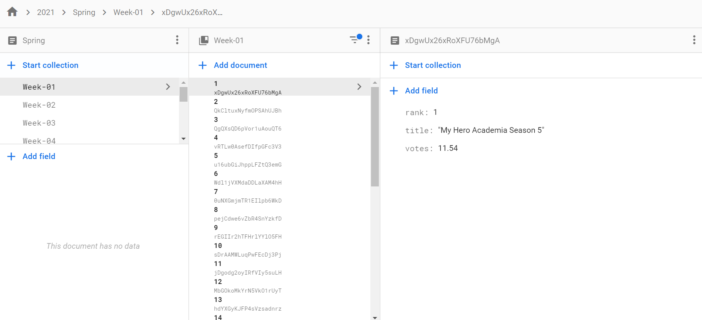

# Where the data comes from

Back to [README](../README.md)

## Web Scraping

The data I need for this project is scraped from [animecorner.me](https://animecorner.me/category/anime-corner/rankings/) and lives in HTML table format. What I've done is written a script that grabs each table cell and slots it into an array with key / value pairs, that lives in a JSON object and is pushed to firestore.

Example:

Turn this table:

| **Rank** | **Title**                      | **Votes** |
| -------- | ------------------------------ | --------- |
| 1        | Remake our Life!               | 9.62%     |
| 2        | Miss Kobayashi's Dragon Maid S | 8.31%     |
| 3        | The Duke of Death and His Maid | 7.96%     |
| ...      | ...                            | ...       |

into this JSON object:

```
{
  ...
  "rankings": [
    {
      "rank": 1,
      "title: "Remake our Life!",
      "votes": 9.62
    },
    {
      "rank": 2,
      "title: "Miss Kobayashi's Dragon Maid S",
      "votes": 8.31
    },
    {
      "rank": 3,
      "title: "The Duke of Death and His Maid",
      "votes": 7.96
    },
    ...
  ]
}
```

then push to Firestore:



As Firestore is a document-model database comprising of documents and collections, the data is stored like this:

- **Year** (Top Level Collection)
  - **Season** (Document)
    - **Period** (Sub-collection)
      - **Item** (Document)
        - Field - Value
        - Field - Value
        - Field - Value
